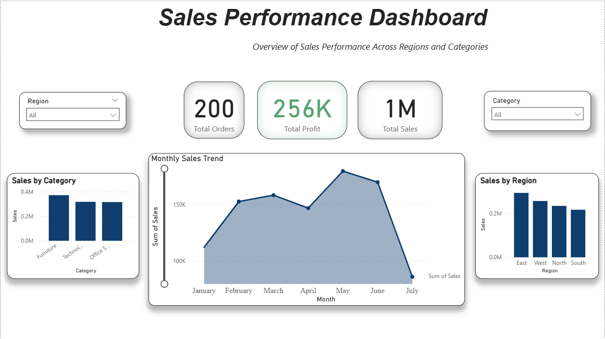

📊 Sales Performance Dashboard

This project showcases an interactive Power BI dashboard built to analyze key business metrics such as sales, profit, and order trends.

🔧 Tools Used
- Power BI
- Excel

📈 Features
- KPI tracking (Total Sales, Profit, Orders)
- Monthly sales trend analysis
- Category-wise and region-wise performance
- Interactive filters (Region & Category)

📸 Dashboard Preview

 💡Insights
- Identified top-performing regions and categories
- Analyzed monthly sales trends
- Enabled data-driven decision-making

👤 Author
Shubham Tiwari
